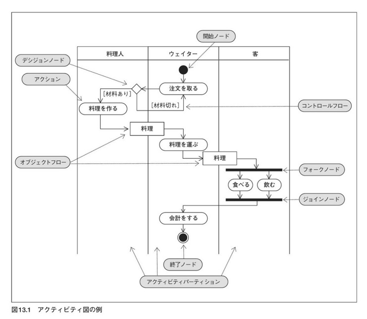

## Activity Diagram
### 액티비티 다이어그램 
-------------

**액티비티 다이어그램**(activity diagram)이란, 처리의 실행수순을 나타내는 다이어그램이다. 
이 다이어그램은, 시스템 개발의 상류공정으로 비지니스 프로세스를 분석하여 나타내거나,  
하류공정으로 프로그램의 상세한 제어흐름을 기재하는 경우 등, 공정에 관계없이 넓게 이용된다.  
 기존에 사용되던 플로우챠트(흐름도)에 가까운 기법이며, 객체지향의 색도 얕으므로,  
 시스템에 그리 익숙하지 않은 유저와도, 커뮤니케이션 취하기 좋은 이점이 있다.  

#### 액티비티 다이어그램의 구성요소
-------------------------------

