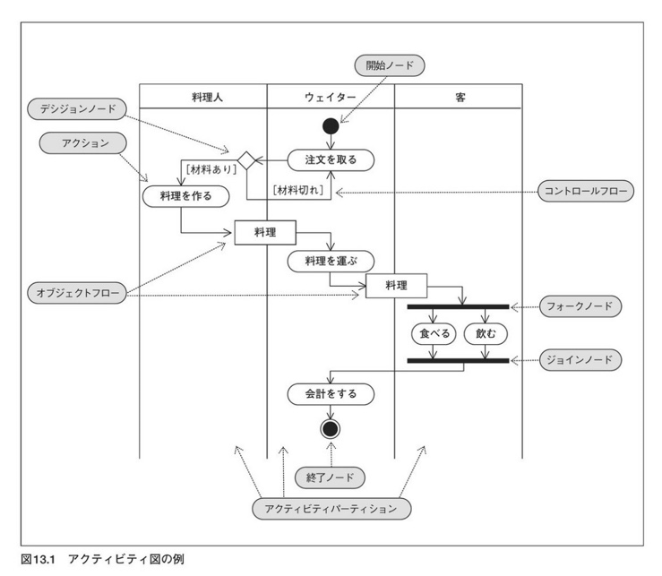
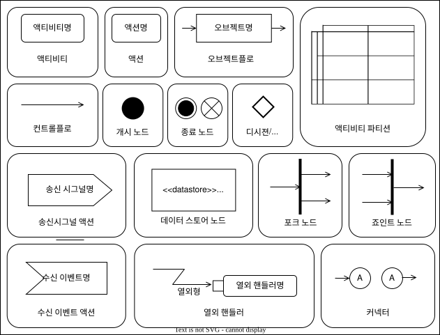
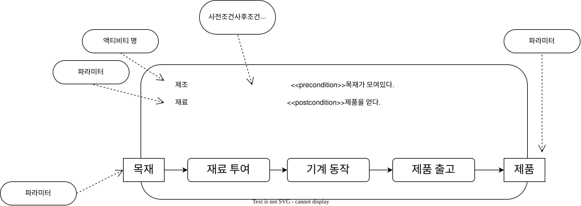
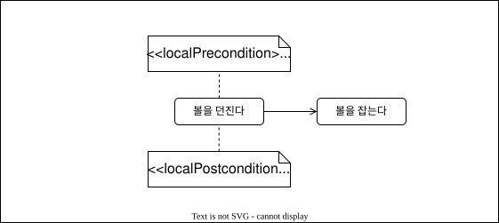
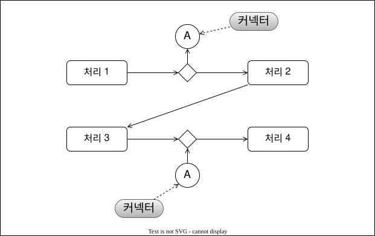

# 액티비티 다이어그램 1

**액티비티 다이어그램**은 처리의 실행 순서와 흐름을 표현하는 다이어그램입니다. 비즈니스 프로세스를 분석하거나 프로그램의 상세 제어 흐름을 설명할 때 사용할 수 있습니다. 기존의 플로우차트와 비슷한 성격을 가지므로, 개발에 익숙하지 않은 사용자와도 절차를 공유하기 쉽습니다.

## 구성 요소

### 액티비티

**액티비티**는 여러 액션이 모여 하나의 처리 절차를 이루는 단위입니다. 파라미터가 있으면 액티비티명 아래에 적고, 사전조건이나 사후조건이 있으면 `<<precondition>>`, `<<postcondition>>` 키워드를 사용합니다.

### 액션

**액션**은 액티비티를 구성하는 가장 작은 처리 단위입니다. 액티비티와 달리 액션 내부에는 다른 액션을 포함하지 않습니다. 사전조건이나 사후조건이 필요하면 해당 액션과 연결된 노트에 `<<precondition>>`, `<<postcondition>>`을 적습니다.

### 개시 노드

**개시 노드**는 액티비티의 처리가 시작되는 지점을 나타냅니다.

### 종료 노드

**종료 노드**는 처리 흐름의 끝을 나타냅니다.

**액티비티 종료 노드**는 전체 액티비티가 종료되었음을 의미합니다. **흐름 종료 노드**는 액티비티 안의 특정 흐름만 종료되었음을 의미합니다. 포크 노드로 여러 흐름이 병렬로 진행될 때, 그중 하나의 흐름만 끝나는 경우에 흐름 종료 노드를 사용할 수 있습니다.

### 오브젝트 흐름

**오브젝트 흐름**은 액션 사이에서 전달되는 정보나 데이터를 표현합니다. 프로그램 내부 처리를 설명할 때는 매개변수나 반환값을 오브젝트 흐름으로 나타낼 수 있습니다.

### 커넥터

**커넥터**는 멀리 떨어진 액션 사이를 연결할 때 사용합니다. 다이어그램이 복잡해져 선이 지나치게 길어지는 경우, 알파벳 같은 식별자를 붙인 커넥터로 흐름을 이어 줍니다.

### 결정 노드와 병합 노드

**결정 노드**는 조건에 따라 하나의 흐름을 여러 흐름으로 분기합니다. 각 흐름에는 대괄호로 감싼 조건식을 적을 수 있으며, 이를 가드 조건이라고 합니다.

**병합 노드**는 여러 흐름을 하나의 흐름으로 합칠 때 사용합니다.

### 포크 노드와 조인 노드

**포크 노드**는 하나의 흐름을 여러 병렬 흐름으로 나눕니다. **조인 노드**는 병렬로 진행된 여러 흐름을 동기화하여 하나의 흐름으로 합칩니다.

### 액티비티 파티션

**액티비티 파티션**은 액션을 실행하는 주체나 단계별 영역을 구분할 때 사용합니다. 파티션을 직접 그리거나, 액션에 소속명을 붙여 표현할 수 있습니다. 모델 외부에서 일어나는 액션은 `<<external>>` 키워드를 붙여 표시할 수 있습니다.

