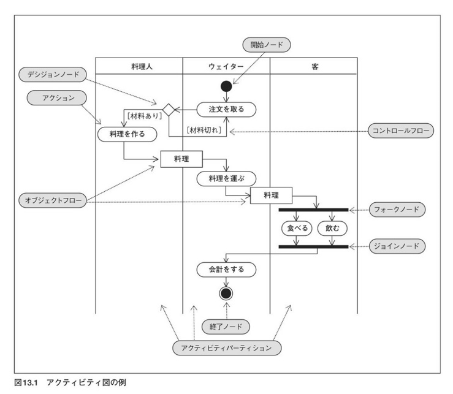

## Activity Diagram
### 액티비티 다이어그램 
-------------

**액티비티 다이어그램**(activity diagram)이란, 처리의 실행수순을 나타내는 다이어그램이다. 
이 다이어그램은, 시스템 개발의 상류공정으로 비지니스 프로세스를 분석하여 나타내거나,  
하류공정으로 프로그램의 상세한 제어흐름을 기재하는 경우 등, 공정에 관계없이 넓게 이용된다.  
 기존에 사용되던 플로우챠트(흐름도)에 가까운 기법이며, 객체지향의 색도 얕으므로,  
 시스템에 그리 익숙하지 않은 유저와도, 커뮤니케이션 취하기 좋은 이점이 있다.  

#### 액티비티 다이어그램의 구성요소
-------------------------------

### 액티비티
**액티비티**는, 일련의 액션이 정리되어진 처리수순을 나타낸다.  

액티비티에 파라미터가 있을 경우, 액티비티명 아래에 기재한다. 사전조건이나 사후조건이 있을 경우  
`<<precondition>>` , `<<postcondition>>` 을 기재한다. 
 

 
### 액션
**액션**은 액티비티를 편성하는 처리의 단위다.  
 액션은 액티비티와 다르게 내부에 다른 액션을 넣을 수가 없다.  
 액션에 사전조건, 사후조건이 있을 때엔, 대상이 되는 액션과 엮인 노트에
 키워드 `<<precondition>>` , `<<postcondition>>`을 추가하여 기재한다.   
  
 
### 개시 노드
 **개시 노드**는, 일련의 액티비티가 처리를 개시하는 지점을 나타낸다. 
 
 
### 종료 노드
 **종료 노드**는, 일련의 처리를 종료하는 지점을 나타낸다. 
 종료처리에 따라 2종류의 종료 노드가 있다.
 
#### `액티비티 종료 노드`
**액티비티 종료 노드**는, 일련의 액티비티의 처리를 안전히 종료했다는 것을 나타낸다.

#### `흐름 종료 노드`
**흐름 종료 노드** 는, 액티비티내 하나의 흐름이 끝났을 때 사용한다.  
포크노드의 의해 복수의 흐름이 평행될 때, 그 중 하나가 끝났을 경우에도 사용한다.

### 흐름 오브젝트
**흐름 오브젝트**는, 액션간 정보의 흐름을 오브젝트로 표현한 것이다.  
또한, 프로그램 내부의 처리를 나타낼 경우, 처리의 메개변수나 리턴 값을 상호작용 오브젝트로 표현할 수 있다. 
액티비티파티션을 경유해서 사용할 경우 액티비티 파티션 사이에, 흐름 오브젝트를 같이 그릴 수가 있다.  
 

### 커넥터
**커텍터**는 액티비티 다이어그램의 복잡도가 상승할 경우 멀리 있는 액션간 접속할 필요성이 있을 경우 사용한다. 
접속 되어 있는 액션으로부터, 한번더 커넥터를 흐름에 넘겨, 접속된 다음 액션 주변에 커넥터를 표기한다.  
보통 [A] 알파벳 1문자로 사용된다.

 

### 디시젼 노드와 머지 노드
**디시젼 노드**를 쓰면, 조건에 의해 흐름 하나를 여러개로 분기할 수 있다. 역으로 **머지 노드**는 복수의 노드를 하나로 만드는 역할을 한다.  
디시젼 노드의 경우 분할할 때 각각의 흐름 컨트롤에, 조건식을 대괄호에 넣어 분기하는 조건을 지정한다. 이 조건을 **가드 조건**이라 한다.  

 

### 포크 노드와 조인트 노드
**포크 노드**는, 하나의 흐름을 복수의 흐름으로 나눠 평행 처리하는 것을 나타낸다.  
역으로 **조인트 노드**는, 비동기에 평행처리된 노드를, 동기하여 하나의 흐름으로 만드는 것을 나타낸다. 

 

### 액티비티 파티션
**액티비티 파티션**은, 액션을 실행하는 주체나 각 페이즈에 액티비티 다이어그램 요소를 그룹화한 것이다. 

 

 파티션에 소속된 액션은, 파티션을 실제 표기하는 것 뿐만 아니라 액션에 소속명을 부가하여 나타낼 수도 있다. 
 또한, 액션이 모델 외부 영역에서 일어났을 경우엔, 그 액션에 키워드 `<<external>>`을 부가하여 나타낼 수도 있다.  
 

