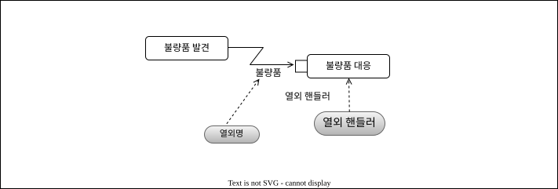
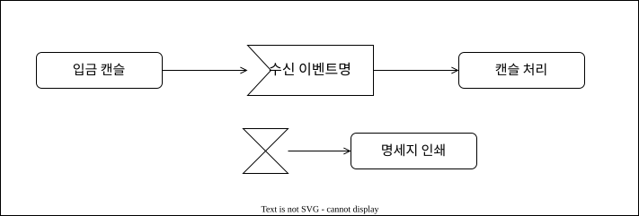

# 액티비티 다이어그램 2

## 예외 핸들러

**예외 핸들러**는 액티비티 안에서 예외가 발생했을 때 수행할 대응 처리를 표현합니다.

## 수신 이벤트 액션

**수신 이벤트 액션**은 특정 이벤트가 발생하기를 기다리는 액션입니다. 기다리는 이벤트가 시간과 관련된 경우에는 모래시계 아이콘을 함께 표시할 수 있습니다.

## 송신 시그널 액션

**송신 시그널 액션**은 다른 액티비티나 객체에 시그널을 보내는 액션입니다.

## 데이터 스토어 노드

**데이터 스토어 노드**는 데이터베이스처럼 데이터가 지속적으로 보관되는 대상을 나타냅니다.

## 확장 영역

**확장 영역**은 여러 입력값을 반복 또는 병렬로 처리하는 영역입니다. 입력값은 보통 리스트나 컬렉션 형태로 표현하며, 처리 방식에 따라 `parallel`, `iterative`, `stream` 모드를 사용할 수 있습니다.

### parallel

`parallel` 모드는 컬렉션의 각 입력값을 병렬로 처리합니다. 입력값 수만큼 영역 안의 동작이 동시에 실행됩니다.

### iterative

`iterative` 모드는 컬렉션의 입력값을 순차적으로 처리합니다. 하나의 입력값 처리가 끝난 뒤 다음 입력값 처리가 시작됩니다. 출력값이 있는 경우 입력 순서에 맞게 결과가 컬렉션에 저장됩니다.

### stream

`stream` 모드는 입력 흐름을 연속적으로 처리합니다. 출력값이 있는 경우 입력 컬렉션과 대응되는 형태로 결과 컬렉션을 구성합니다.

## 인터럽트 가능 액티비티 영역

**인터럽트 가능 액티비티 영역**은 특정 조건이나 이벤트가 발생했을 때 기존 흐름을 중단하고 별도의 처리를 수행하는 영역입니다. 수신 이벤트 액션이 상황 발생을 감지하고, 일반 흐름과 다른 예외 흐름으로 전환합니다.

