### 열외 핸들러
**열외 핸들러**는, 액티비티내에 열외가 발생한 경우, 대응 처리를 기재한다.  
 

### 수신 이벤트 액션
**수신 이벤트 액션**은, 특정 이벤트가 일어나기를 기다리는 액션이다.  
기다리는 이벤트가 시간에 관한 이벤트(ex. 매주 일요일 오전 0시에 발생등)가 있을 경우, 강제하기위해, 모래시계 아이콘을 기재한다. 
 

### 송신 시그널 액션
**송신 시그널 액션**은, 다른 액티비티에서 받은 정보로부터, 시그널을 송신하는 액션이다.  
 

### 데이터 스토어 노드
**데이터 스토어 노드**는, 데이터베이스등 영속적 데이터가 보관될 수 있는 대상을 나타낸다.  
 

### 확장영역
**확장영역**은, 복수의 입력치를 처리하기 위해 처리 부분을 둘러싼 영역이다.  
복수 입력치는 리스트 등 컬렉션 타입으로 만든다. 컬렉션의 처리방법에 따라, `parallel`, `iterativ`, `stream`의 3개의 모드가 있다.

#### parallel
 모드에 `parallel`이 지정된 경우, 컬렉션 각각 입력치가 평행처리 된다. 입력치의 숫자만큼 확장영역안 동작이 평행되어 실행된다.
 
#### iterative
 모드에 `iterative`가 지정된 경우, 컬렉션은 순차처리된다. 하나의 입력치 처리가 완료된 후 다음 처리가 실행된다. 
 처리에 출력치가 있을 경우, 입력치 순번으로 출력치가 컬렉션에 수납된다.

#### stream
 모드에 `stream`이 지정된 경우, 입력치에 대해 처리가 한번에 실행된다. 처리에 출력치가 있을 경우, 입력 컬렉션과 같은 구성으로 컬렉션을 구축한다.  
 

### 인터럽트 가능 액티비티 영역
 **인터럽트 가능 액티비티 영역**은, 그 영역 내 특정 조건이 발생한 경우, 수신이벤트 액션이 상황 발생을 탐지하여, 통상 흐름과 별도의 처리를 한다.  
 

