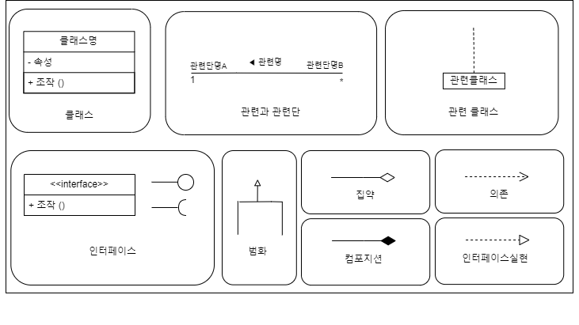
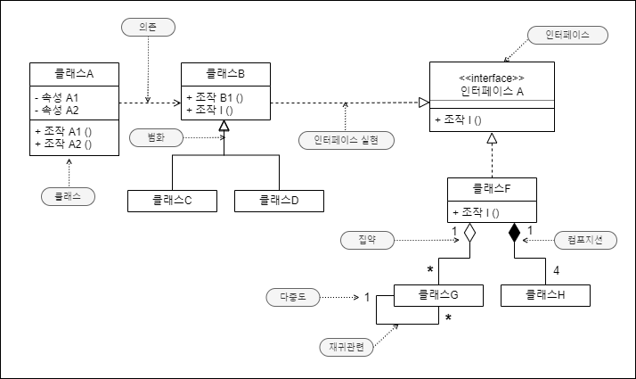
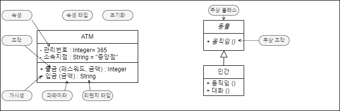

# iv. Class Diagram

### 클래스 다이어그램 
-------------

**클래스 다이어그램** (class diagram)에선, 클래스간의 관계에의해, 시스템의 정적인 구조를 나타낸다. 클래스란, 시스템을 구성하는 **오브젝트**(object)의 공통된 특징을 추출하여, 
일반화한 것으로 오브젝트의 모형이라 말할 수 있다.  

일반적인 시스템은, 클래스를 정의하여, 클래스를 구상화하여 작성한 오브젝트가 각각 협조하는 것으로 동작한다. 클래스 다이어그램은 시스템의 정적인 구조를 대표하는 중요한 다이어그램이며, 분석, 설계같은
시스템개발의 여러가지 공정에 이용된다.

### 클래스 다이어그램의 예
-------------------------------
클래스 다이어그램은, **클래스**(class)나 인터페이스 (interface)같은, 이 것들을 연결하는 여러가지 관계의 의해 구성된다. 
 
 
### 은행 클래스 다이어그램
--------------------------------------

 
### 클래스 다이어그램의 구성요소
--------------------------------------
#### 클래스
 **클래스**는, 오브젝트를 특정 기준으로 분류하여, 공통요소를 추출하여 추상화한 것이다. 클래스는 속성과 조작을 가진다.  
 UML에선, 클래스

