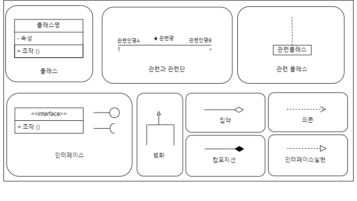
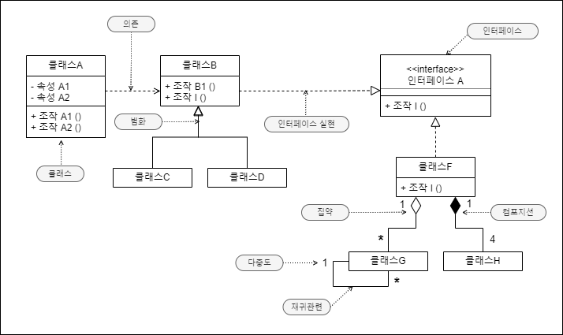
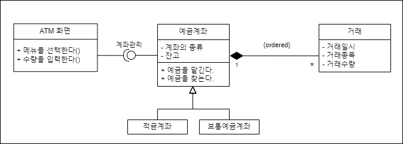
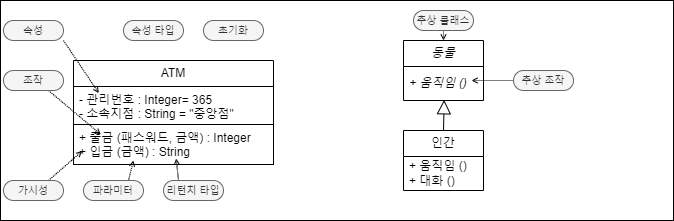
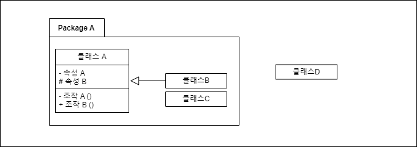

# 클래스 다이어그램

**클래스 다이어그램**은 클래스와 클래스 사이의 관계를 통해 시스템의 정적인 구조를 표현하는 다이어그램입니다. 클래스는 시스템을 구성하는 객체의 공통 특징을 추출해 일반화한 것으로, 객체를 만들기 위한 설계도라고 볼 수 있습니다.

일반적인 객체지향 시스템은 클래스를 정의하고, 그 클래스로부터 생성된 객체들이 서로 협력하면서 동작합니다. 따라서 클래스 다이어그램은 분석과 설계 단계에서 시스템 구조를 설명하는 핵심 다이어그램입니다.

## 클래스 다이어그램의 예

클래스 다이어그램은 **클래스**, **인터페이스**, 그리고 이들을 연결하는 관계로 구성됩니다.

## 은행 클래스 다이어그램 예

## 구성 요소

### 클래스

**클래스**는 객체를 특정 기준으로 분류하고, 공통 속성과 동작을 추상화한 요소입니다. UML에서 클래스는 보통 세 칸으로 나누어진 사각형으로 표현합니다.

- 첫 번째 칸: 클래스명
- 두 번째 칸: 속성(attribute)
- 세 번째 칸: 조작(operation)

### 속성과 조작

**속성**은 클래스가 가지는 데이터나 상태를 의미합니다. **조작**은 클래스가 수행할 수 있는 기능이나 행위를 의미합니다. 접근 제한자는 보통 다음과 같이 표기합니다.

| 기호 | 의미 |
| --- | --- |
| `+` | public |
| `-` | private |
| `#` | protected |
| `~` | package |

### 연관

**연관**은 클래스 사이에 구조적인 관계가 있음을 나타냅니다. 두 클래스가 서로를 알고 있거나, 한 객체가 다른 객체를 참조하는 경우에 사용합니다.

### 다항 연관

**다항 연관**은 세 개 이상의 클래스가 하나의 관계에 함께 참여할 때 사용합니다.

## 마무리

클래스 다이어그램은 시스템의 데이터 구조와 객체 간 관계를 명확히 보여 줍니다. 구현 전에 클래스 책임과 관계를 검토할 수 있어 설계 품질을 높이는 데 도움이 됩니다.