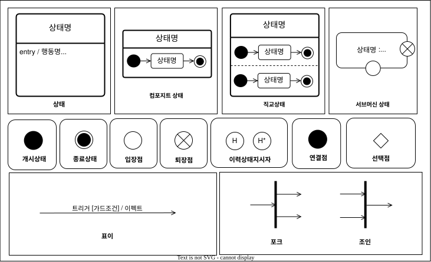
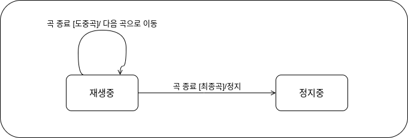
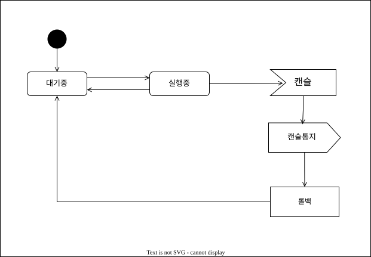
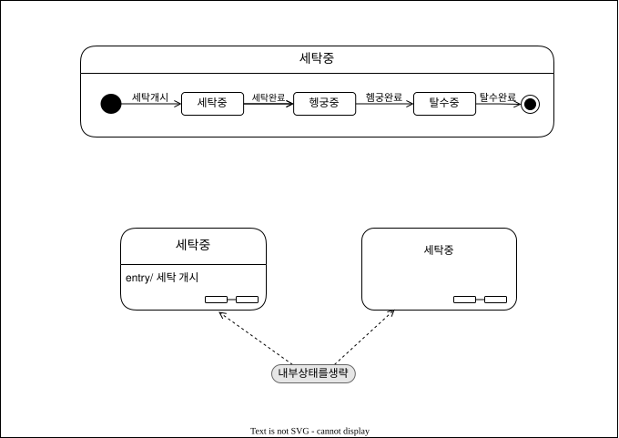
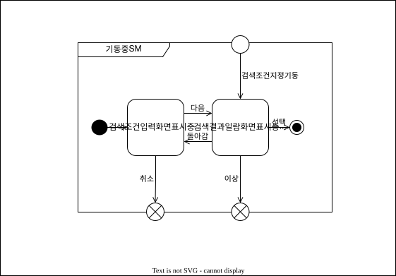
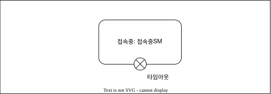
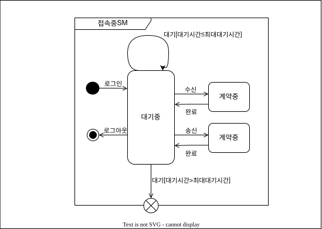
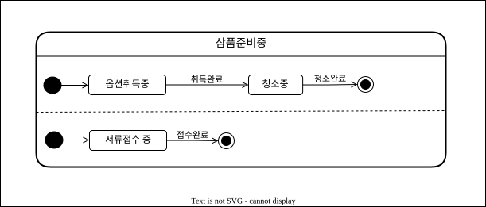
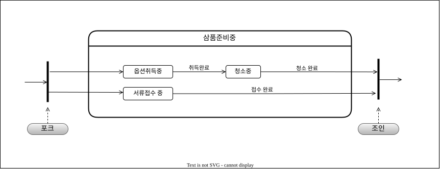

# 스테이트 머신 다이어그램 1

**스테이트 머신 다이어그램**은 특정 객체의 상태 변화와, 상태 변화에 따라 수행되는 동작을 표현하는 다이어그램입니다. 시스템은 외부 이벤트, 시간 경과, 조건 변화에 따라 상태를 바꾸며 동작합니다.

예를 들어 전원 스위치를 켜면 장치 상태가 `OFF`에서 `ON`으로 바뀌고, 전화를 걸면 상태가 `연결 중`에서 `통화 중`으로 바뀝니다. 스테이트 머신 다이어그램은 이런 변화를 객체의 생명주기 관점에서 모델링합니다.

## 특징

스테이트 머신 다이어그램은 주로 **상태**와 **전이**로 구성됩니다. 상태는 객체가 어떤 시점에 놓인 상황을 나타내고, 전이는 이벤트나 조건에 의해 상태가 바뀌는 것을 나타냅니다.

다른 UML 다이어그램이 여러 객체의 관계나 흐름을 다루는 경우가 많은 반면, 스테이트 머신 다이어그램은 하나의 객체에 집중합니다. 상태명은 `대기 중`, `처리 중`, `승인됨`처럼 현재 상태가 드러나도록 작성하는 것이 좋습니다.

## 예시: 주문 객체

주문 업무를 예로 들면 `주문` 객체는 주문이 접수되면 `수주됨` 상태로 전이합니다. 이후 상품의 배송 상황에 따라 `배송 중`, `배송됨`, `납품됨` 같은 상태를 거칩니다. 납품이 완료되면 청구 과정을 통해 `청구됨` 상태로 전이할 수 있고, 반품이 발생하면 `반품됨` 상태로 이동할 수 있습니다.

## 구성 요소

### 개시 상태

**개시 상태**는 객체의 상태 변화가 시작되는 지점을 나타냅니다. 일반적으로 객체가 생성되는 시점을 의미합니다.

### 종료 상태

**종료 상태**는 상태 전이가 완료되었음을 나타냅니다. 객체가 종료 상태에 도달하면 보통 생명주기가 끝난 것으로 봅니다. 다만 데이터베이스에 영속화되는 객체처럼 종료 상태가 명확하지 않은 경우에는 생략될 수 있습니다.

### 상태

**상태**는 객체가 특정 시점에 놓인 상황이나 단계를 나타냅니다. 상태는 이름 영역과 내부 동작 영역으로 나눌 수 있으며, 내부 동작 영역에는 해당 상태에서 수행되는 행동이나 내부 전이를 적습니다.

### 전이

**전이**는 객체가 이벤트나 조건에 반응하여 한 상태에서 다른 상태로 이동하는 것을 의미합니다. 전이 화살표에는 `트리거 [가드 조건] / 이펙트` 형식으로 정보를 적을 수 있습니다.

가드 조건이 있으면 조건을 만족할 때만 전이가 발생합니다. 트리거와 이펙트는 문자열뿐 아니라 시그널이나 액션 요소로도 표현할 수 있습니다.

### 컴포짓 상태

**컴포짓 상태**는 내부에 또 다른 상태 전이 영역을 포함하는 상태입니다. 복잡한 상태를 계층적으로 표현할 때 사용하며, 내부 구조는 필요에 따라 생략할 수 있습니다.

### 입장점과 퇴장점

**입장점**은 외부에서 스테이트 머신이나 컴포짓 상태 내부로 들어오는 지점을 나타냅니다. **퇴장점**은 내부 상태에서 외부로 빠져나가는 지점을 나타냅니다. 하나의 스테이트 머신은 여러 입장점과 퇴장점을 가질 수 있습니다.

### 서브머신 상태

**서브머신 상태**는 다른 스테이트 머신을 참조하는 상태입니다. 참조되는 스테이트 머신을 서브머신, 이를 호출하는 상태를 서브머신 상태라고 합니다. 보통 `상태명: 스테이트 머신명` 형식으로 표기합니다.

### 직교 상태

**직교 상태**는 하나의 컴포짓 상태 안에 여러 상태 전이 영역이 병렬로 존재하는 경우를 말합니다. 직교 상태에서 다른 상태로 전이하려면 모든 영역의 상태 전이가 완료되어야 합니다.

### 포크와 조인

**포크**는 직교 상태의 시작을, **조인**은 직교 상태의 종료를 나타냅니다. 직교 상태 내부의 개시 상태와 종료 상태를 간단히 표현하고 싶을 때 사용합니다.

