## State Machine Diagram
### 스테이트 머신 다이어그램
-------------

**스테이트 머신 다이어그램**(state machine diagram)은, 시스템을 편성하는 오브젝트의 상태전이와, 
상태전이에 따른 움직임을 표현할 수가 있다. 시스템은, 이용되는 곳이나 관계되는 외부 시스템 상태변화에 적응하기위해, 
상태를 변화시켜, 그 상태에 따라 움직일 필요가 있다.  
 시스템의 각 부분 상태 변화는 아래와 같은 것을 생각할 수 있다. 
 
 - 전원 스위치를 키면, OFF에서 ON이 된다.
 - 전화를 걸면, 전화 연결 중에서 통화중이 된다. 

스테이트 머신 다이어그램은 2종류가 있다. 첫번째는, 특정 오브젝트(인스턴스) 상태가 이벤트 발생이나 시간 경과와 함께 어떻게  
변화하는가를 나타낸 다이어그램이다. 오브젝트의 생성부터 소멸까지 라이프사이클을 모델화합니다.

## 스테이트머신 다이어그램 예
 스테이트 머신 다이어그램은, 주로 **상태**와 **전이**라는 요소로 구성된다. 상태는 표현대상인 오브젝트의 상태를 나타내며  
전이는 상태의 변이와 변화를 나타낸다. 상태명은, 영어에서는 [~ing]에 가까우며, 한국어로는 [~하는중]이나 [~ 함]같이 쓰면, 그것이 상태라는 것을 잘 알 수 있다.  
 스테이트 머신 다이어그램외의 다어이그램은 복수의 오브젝트를 모은 단위에 기재하는것에 대해, 스테이트 머신 다이어그램은 하나에 오브젝트에 집중한다.  
 
## 주목 오브젝트 예
 일반적인 수주업무를 보면, 오브젝트 [주문]은, 수주됨으로, 컴포짓상태[수주됨]으로 전이한다. [수주됨]의 상태내에서, 수주된 상품의 배달 상황이 [배달됨]과 [남품됨] 상태  
 로 관리된다. 수주된 상품이 남품완료되면 청구하여 [청구됨] 상태로 전이한다. 또한, [청구됨]의 상태가 반품되면, [청구함]의 퇴장점[반품]에서 [반품됨]으로 전이한다.  
 반품 후, 대신 배송될 상품을 재배송할 경우 [반품됨] 에서 [수주됨] 으로 전이
 
# 스테이트 머신 다이어그램의 구성요소

## 개시상태
 **개시상태**는 적어도 1개의 개시상태가 필요하다. 개시상태는 오브젝트가 생성된 타이밍을 나타낸다.
 
## 종료상태
 **종료상태**는 영역내 전이가 완료된 것을 나타낸다. 일반적으로, 오브젝트는 종료상태가 된 시점에 파기된다.  
 개시상태와는 다르게, 스테이트 머신 다이어그램엔 존재하지 않은 경우도 있다. 이 경우엔, 오브젝트가 데이터베이스등에 격납되어 영속화되는 등 여러가지 경우가 있다.  
 (단, 영속화된 오브젝트가 물리적으로 제거되는 경우는 종료상태가 존재한다.) 거꾸로 하나의 스테이트 머신 다이어그램 복수의 종료상태를 지개하는 경우도 있다.  
 
## 상태
 **상태**는, 오브젝트의 어떤 시점에 관한 상황이나 단계를 나타낸다. 상태는 이름도면과 내부 액티비티·전이도면에 분할할 수가 있다. 이름도면에는 상태명을 기재하고,  
 내부 액티비티·전이도면에는 오브젝트가 그 상태 중에 실행하는 행동 또는 전이를 [라벨/식] 형식으로 기재한다. 
 - 내부 전이 - 다른 행동으로 전이되지 않는 모든 행동들을 라벨에 기재한다.
 - 그 외 - 아래에 음량변경과 같이 전이하지 않고 내부에서 처리할 수 있는 내용은 특수하게 표기한다.

  

## 전이
 **전이**, 오브젝트가 특정 이벤트에 반응하여, 어떠한 상태로부터 다른 상태로 변하는 것을 말한다.  
  전이의 화살표는, 트리거명, 가드 조건, 이펙트명을 [트리거명［가드 조건］/이펙트명] 같은 형식으로 기재하는 것이 가능하다. (트리거는 이 전이와 관련된 이벤트를 가르킨다.)  
  가드 조건이 기재되어있을 경우엔, 조건에 만족하는 경우만 전이한다. 
  
  
  
  또한, 전이의 트리거나 이펙트는, 문자열로 기재하는것 뿐만아니라, 시그널이나 액션의 요소를 기재하는 것으로, 수신시그널은 다른 오브젝트로 부터 조작을 기동시키는것(트리거)를 나타낸다. 
  
  
  
## 컴포짓 상태
 [컴포짓 상태]는, 넣어지는 인자의 상태전이 영역을 포함한 상태를 말한다.  
 컴포짓 상태 내부는 생략가능하다.  
   
  
