## 이력상태지시자
 **이력상태지시자**는, 컴포짓상태에서 다른 상태로 전이할 때, 그 시점에 액티브한 서브상태를 기억하고싶을 경우 사용한다. 
 일반적으로, 특별히 지정하지않는한 (입장점으로 전이등), 컴포짓상태는 그 안에 포함되어있는 개시상태로부터 전이는 되지만,  
 이력상태지시자를 쓸 경우, 다시 한번 기억해둔 상태로부터 전이 할 수 있습니다. 
  컴포짓 상태가 또 하나의 컴포짓 상태를 포함할 경우, 액티브한 서브상태를 복수의 단계에 걸쳐 기억하는 경우가 있다.  
 이 경우, 이력상태지시자의 H에 아스타리스크(*)
 
  
