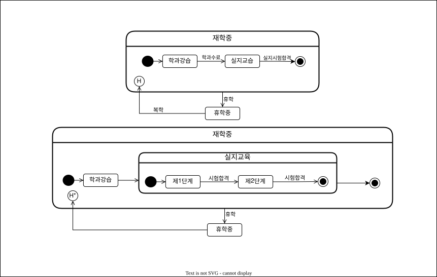
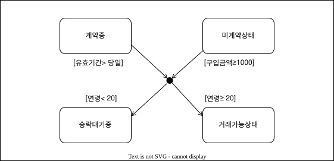
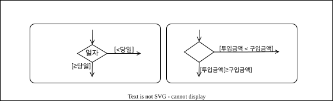

# 스테이트 머신 다이어그램 2

## 이력 상태 지시자

**이력 상태 지시자**는 컴포짓 상태에서 다른 상태로 전이했다가 다시 돌아올 때, 이전에 활성화되어 있던 서브 상태를 기억하고 싶을 때 사용합니다.

기본적으로 컴포짓 상태에 다시 진입하면 내부의 개시 상태부터 전이가 시작됩니다. 하지만 이력 상태 지시자를 사용하면 이전에 머물렀던 상태에서 다시 시작할 수 있습니다. 컴포짓 상태 안에 또 다른 컴포짓 상태가 포함되어 여러 단계의 이력을 기억해야 할 경우에는 `H*`로 깊은 이력(deep history)을 표현합니다.

## 연결점

**연결점**은 여러 전이를 연결하거나 분리할 때 사용합니다. 복잡한 전이를 하나로 정리해 다이어그램을 단순하게 만들 수 있습니다.

## 선택점

**선택점**은 연결점처럼 여러 전이를 연결하거나 분리하지만, 가드 조건을 평가하는 방식에 차이가 있습니다. 선택점에서는 전이가 선택점에 도달한 뒤 조건을 평가해 다음 전이 경로를 결정합니다.

## 프로토콜 스테이트 머신

**프로토콜 스테이트 머신**은 클래스나 컴포넌트의 동작 순서를 정의하는 스테이트 머신입니다. 표기법은 일반 스테이트 머신 다이어그램과 비슷하지만, 클래스나 컴포넌트가 제공하는 조작과 상태 전이의 관계를 더 직접적으로 표현합니다.

프로토콜 스테이트 머신의 전이는 해당 클래스나 컴포넌트가 가진 조작의 호출과 명확하게 대응됩니다.

