## 이력상태지시자
 **이력상태지시자**는, 컴포짓상태에서 다른 상태로 전이할 때, 그 시점에 액티브한 서브상태를 기억하고싶을 경우 사용한다. 
 일반적으로, 특별히 지정하지않는한 (입장점으로 전이등), 컴포짓상태는 그 안에 포함되어있는 개시상태로부터 전이는 되지만,  
 이력상태지시자를 쓸 경우, 다시 한번 기억해둔 상태로부터 전이 할 수 있습니다. 
  컴포짓 상태가 또 하나의 컴포짓 상태를 포함할 경우, 액티브한 서브상태를 복수의 단계에 걸쳐 기억하는 경우가 있다.  
 이 경우, 이력상태지시자의 H에 아스타리스크` * ` 딥히스토리로 표현한다.
 
 
  
 ## 연결점
 **연결점**은, 복수의 전이를 연결하거나, 분리할 때 사용한다. 연결점을 사용함으로 복수의 전이를 하나로 정리하여, 타임라인을 심플하게 기재할 수 있다.
 
  
  
 ## 선택점
 **선택점**은, 연결점과 같이 복수의 전이를 연결하거나, 분리시킬 때 사용한다. 연결점과의 차이는, 가드 조건의 타이밍이다. 
 연결점은, 상태간의 가드조건이 전부 만족할 경우 전이한다.
 
 
 
 ## 프로토콜 스테이트머신
 **프로토콜 스테이트머신**은, 클래스나 컴포넨트의 동작수순을 정의하는 스테이트 머신 다이어그램이다. 표기자체는 일반 스테이트  
 머신 다이어그램과 거의 가티잠ㄴ, 보다 실장에 밀착한 상태전이를 표현할 수 있다.  
  프로토콜 스테이트 머신의 전이는, 그 클래스나 컴포넨트가 가진 조작의 기동에 명확하게 대응한다.  
 
