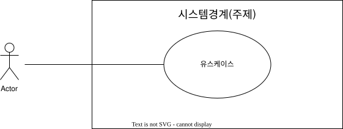
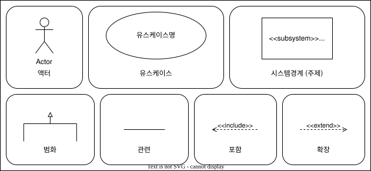
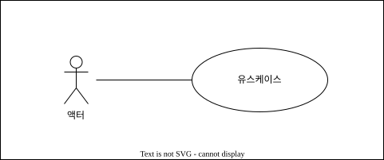
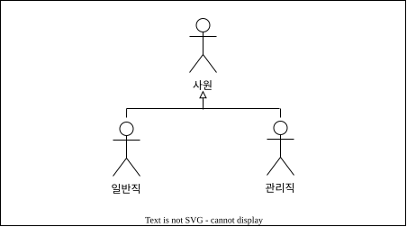
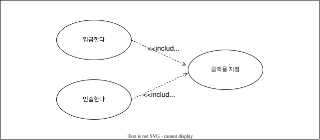
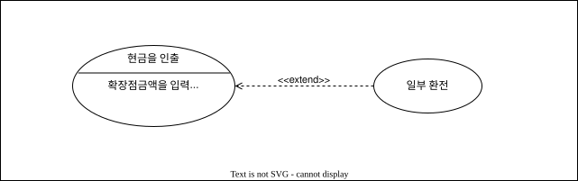
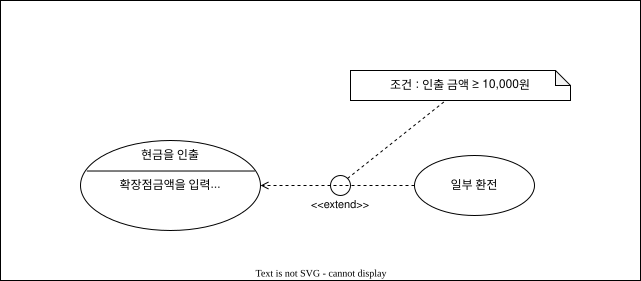
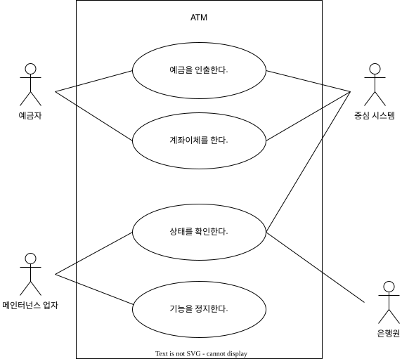

# 유스케이스 다이어그램

유스케이스 다이어그램은 시스템이 제공하는 기능과 그 기능을 사용하는 외부 주체를 표현합니다. 시스템의 범위, 액터, 유스케이스, 그리고 이들 사이의 관계를 한눈에 파악할 수 있어 요구사항 분석 단계에서 자주 사용됩니다.

## 구성 요소

### 유스케이스

**유스케이스**는 액터 관점에서 보이는 시스템의 기능입니다. 일반적으로 타원 안에 기능명을 적어 표현합니다. 확장점(extension point)이 필요한 경우에는 타원 내부를 나누어 유스케이스명과 확장점을 함께 표시할 수 있습니다.

직사각형으로 유스케이스를 표현할 수도 있으며, 이때는 `<<usecase>>` 키워드를 추가하거나 오른쪽 위에 작은 타원 기호를 표시합니다.

### 액터

**액터**는 시스템과 상호작용하는 외부 주체입니다. 사용자, 외부 시스템, 하드웨어 장치 등이 액터가 될 수 있습니다.

액터는 보통 사람 모양의 기호로 표현하지만, 직사각형에 `<<actor>>`를 붙이거나 컴퓨터 같은 아이콘으로 표현할 수도 있습니다. 액터명에는 실제 개인 이름이 아니라 `고객`, `관리자`, `결제 시스템`처럼 역할을 나타내는 이름을 사용합니다.

### 관련

**관련**은 액터와 유스케이스 사이의 상호작용을 나타냅니다. 액터가 어떤 유스케이스를 실행하거나, 유스케이스의 결과를 받는 관계를 실선으로 연결합니다.

### 일반화

**일반화**는 액터나 유스케이스 사이의 공통점을 추상화할 때 사용합니다. 예를 들어 `일반 직원`과 `관리자`가 모두 직원의 역할을 공유한다면, 공통 액터인 `직원`으로 일반화할 수 있습니다.

### 포함

**포함(include)**은 여러 유스케이스에서 반복되는 공통 절차를 별도의 유스케이스로 분리할 때 사용합니다. 예를 들어 `입금한다`와 `출금한다`가 모두 `금액을 입력한다` 절차를 사용한다면, 두 유스케이스가 `금액을 입력한다`를 포함하도록 표현할 수 있습니다.

포함 관계는 포함하는 유스케이스에서 포함되는 유스케이스 방향으로 점선 화살표를 그리고 `<<include>>` 키워드를 붙입니다.

### 확장

**확장(extend)**은 기본 유스케이스의 특정 시점에 선택적이거나 조건적인 동작을 추가할 때 사용합니다. 예를 들어 `현금을 출금한다` 과정에서 사용자가 원할 때만 `일부 금액을 환전한다` 기능이 실행된다면, 환전 기능은 출금 유스케이스를 확장하는 유스케이스가 됩니다.

확장 관계는 확장하는 유스케이스에서 확장되는 유스케이스 방향으로 점선 화살표를 그리고 `<<extend>>` 키워드를 붙입니다.

### 조건과 확장점

확장 관계에 조건이 있다면 조건식을 함께 적을 수 있습니다. 확장이 발생하는 지점은 유스케이스 내부의 확장점으로 표현합니다.

## ATM 유스케이스 예

## 마무리

유스케이스 다이어그램은 세부 구현보다 시스템이 제공해야 할 기능과 외부 주체의 관계를 명확히 하는 데 초점을 둡니다. 요구사항을 처음 정리할 때 특히 유용합니다.