# UML 개요

건국대학교 일반대학원 전기기계 및 전력전자 석사과정 노태형
 

## 서론
일본에서 배웠던 UML을 가지고 소프트웨어 아키텍처 설계의 중요성을 알리기위해 이번 글을 적어봅니다.

목차
- 서론
- 1. UML 이란
- 2. Usecase Diagram
- 3. 
## i. UML 이란
----------------------
1998년 등장한 UML은, 지금은 기술자로써 습득하지 않으면 안돼는 필수 설계기술이 되었다. 
현재, UML은 2.0으로 메이저 버전업을 한 뒤 2.1이 되어 컴포넌트나 엠베디드 시스템에 대응하고 있다.
또한 UML이 ISO 표준이 됨으로 명실상부한 세계기준의 설계표기가 되었다.

UML이란, Unified Modeling Language(통일모델링언어)의 약잘, 시스템의 분서, 설계 실장등을 원만히 진행하기위해 작성된 [모델]의 표기법을 정의한다.
UML은 오브젝트지향기술의 표준화를 진행하기 위해 OMG(Object Management Group)에서 기준이 책정되었다.

UML은 모델링을 위한 언어다. 모델이란 어떠한 대상을 글이나 그림으로 표현하는 것으로, 시스템 개발에 있어 시스템 그 자체가 대상이 된다.
단, UML은 시스템개발방법론(개발의 수단이나 방법론등)을 포함하지 않는다. 때문에 실제 시스템개발에서는 UML과는 별도로 개발방법론을 준비해야한다.

## ii. Usecase Diagram
### 유스케이스 다이어그램의 례 
-------------

유스케이스 다이어그램은, 실선은**관련**된 것을 칭하고, 액터와 유스케이스의 관계(실행하는 - 실행되는)을 표시한다. 또한, 시스템의 범위를 명시하기위해, 시스템경계(주제)로 시스템 내부의 요소(유스케이스)를 둘러쌀 수가 있다. 이 시스템의 경계는 주제를 나타내는 이름 (시스템명등)을 만들어, 그 시스템의 기능을 나타내는 것이 가능하다.

#### 유스케이스의 구성요소
-------------------------------

## 유스케이스
유스케이스란, 액터가 보는 시스템의 기능이다.
유스케이스는, 타원 안에 이름을 적어 기재하여 나타낸다. 유스케이스명은 타원 아래 적는 것도 가능하다. 또한 확장점(extension point)가 있을 경우는 타원 중앙에 선을 그어 상부에는 유스케이스명, 하부에는 확장점을 기재한다.
 타원이 아닌 직사각형 유스케이스를 표현하는 것도 가능하나, 이 경우 유스케이스의 상부에 키워드<<usecase>>를 추가하거나 직사각형 오른쪽위에 자그마하게 타원을 추가한다.
 
### 액터
**액터**는, 시스템을 조작하는 유저, 외부의 하드웨어(스캐너등 입출력장치가능), 대상의 시스템과 관련된 외부의 시스템을 나타낸다.
  액터는 주로 인형(봉 모양이기에 스틱맨이라 부른다. 한국에선 졸라맨이라하자.)으로 나타냈었으나, 직사각형에 <<actor>>라 추가하여 표기하거나 액터가 아닌 경우, 컴퓨터등 아이콘을 넣어도 된다.
  액터명에는 실제 이름을 넣는게 아니라 각 역할의 직업군을 넣어준다.
 
### 관련
 **관련**은, 액터와 유스케이스의 관계를 나타낸다. 액터와 유스케이스를 관련지을 때, 그 액터가 유스케이스를 실행하거나, 유스케이스로부터 반응을 얻을 수 있다. 

 
### 범화
 **범화**를 쓰면, 액터끼리나 유스케이스끼리 공통부분을 추상화(일반화)할 수가 있습니다. 이것으로, 다이어그램을 심플하게 그릴 수 있다.
  예를들어, [일반직]과[관리직]이란 액터가 있을 경우, 사원으로써의 역활은 같기에, [사원]이라는 액터를 일반화할 수가 있다.
 
### 포함
 **포함**은 유스케이스의 다른 유스케이스를 포함할 수가 있다. 포함을 쓰면, 공통된기능 (조작순서) 를 표현한다.
 예를들면, [입금한다]란 유스케이스와, [인출한다]라는 유스케이스에, [금액을 지정한다]라는 유스케이스가 포함되었을 경우, 다음과 같이 그릴 수가 있다.
 포함은, 포함하는 유스케이스로부터 포함되는 유스케이스의 점선의 화살촉을 향해, 키워드 <<include>>을 추가한다.

### 확장
**확장**은, 이미 존재하는 유스케이스를, 다른 유스케이스를, 다른 유스케이스의 의해 확장할 경우 사용한다. 예를들면, [예금을 인출한다.]란 유스케이스를 실행 중에 임의의 조작으로부터 예금자의 선택으로 고액지폐의 일부를 환전할 때, [현금을 인출한다]란 유스케이스의 대하여, [일부환전한다]란 유스케이스의 의해 확장이 된다. 
 확장은 , 초안이되는 유스케이스에 대하여, **확장점**이라는 특정 시점에 이행이 됩니다. 이 례에는, 유스케이스 절차 중 하나인 [금액을 입력]할 때의 환전을 할까 말까의 분기점이 있으므로 [금액을입력] 부분의 확장이 된다.  
 실제로 확장을 행하는 타이밍으론, 시스템이 가동 중에 여러 기능등이 추가 되었을 때, 초안이 되었던 유스케이스에 기능을 추가할 때 사용할 수 있다.
 따라서 확장된 유스케이스와 초안이 된 유스케이스는 하ㅏㄴ의 유스케이스로 봐도 된다.
 
### 추가
 확장은 조건이 있을 경우, 조건을 기재할 수 있으며, 조건은 확장을 표시하는 점선 도중에 동그라미를 그려, 거기에 노트를 붙여 기재한다.

### 은행 ATM 유스케이스 다이어그램
--------------------------------------

## 종장

github Address:[https://github.com/Madness-Ro/project-miraisouzouten-document](https://github.com/Robotics-Ro/OpenCV-C--LiDAR)

Special Thanks 
ROS 국비교육 LiDAR 헤딩 팀
