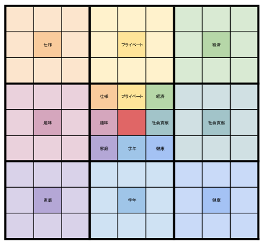

# やむ得ずにプロジェットマネジャーになってみた！

HAL東京先端ロボット開発学科4年　盧　泰亨（ロウ　テヒョン）
 

## はじめに
今回は初めてマネジメントを行う方にも簡単にまねできるような内容でWBSとガントチャートを利用し計画を把握できるようにしました。
そう言っても本文を見ると至極当然の普通のやることリストをばらせて載せった内容でそこまで特別な内容はないんですが。この内容を把握し
チームメンバーと共有しながらプロジェットの進み具合を分かることだけでもプロジェット成功可否が決まると言っても過言ではないかなと考えております。

目次
- 1. 先ず、最初はやることリストを列挙しましょう！
- 2. 優先度をつけましょう！
- 3. 図に変換してみましょう。
- 4. もっと修正を加えてみましょう。
## 1. 先ず、最初はやることリストを列挙しましょう！
プロジェクトに対して何を先にやるかを決めないとどうやって進めばいいか迷って段々やる気がなくなり結局やらなかった経験は一回は経験したと思います。
列挙するとしても直ぐでないとしたら大きな分類からやってみましょう。こういう時は図1の曼荼羅図とかを使うのもお勧めです。
曼荼羅図は９X９のボックスが集まった図で真ん中の四角の３X３のボックスが中心になってまたその中の真ん中の中心になる主題を決めて連想されたイメージを周りのボックスに一つ一つ
入れることから始めます。そうやって連想されたことを書くことで９X９のボックスを埋めていくものでございます。日本の有名な野球選手の大谷さんもこれを新年になった旅使って
やることリストを作成したらしいです。興味ある方は検索してみてください。

 
**図1．曼荼羅図**
## 2. 優先度をつけましょう！
やることリストの作成が終わったとしたら書いたやることリストに対して優先度を付けます。
優先度は高、中、低の順位で先にやらないと次のやることリストに行けないことを高い優先度を付けることで
全体的に優先しないといけないことを分かることができます。
これを図に起こしたものが次に紹介する**WBS(Work Breakdown Sturucture）**
のことです。
## 3. 図に変換してみましょう。

**図2．WBS及びガントチャート**
この図は私が就職する予定の会社から例題としてもらったものです。
区分１から５まで基準点の例としては
|区分|期間|説明|
|------|---|---|
|１|6か月|半年で終わる計画|
|２|3が月|3か月で終わる計画|
|３|1か月|1か月ことで分かれるもの|
|４|2週|2週以内で終わる仕事|
|５|1週|一番細かく分けた項目|
となります。これはあくまで例であるためもっと個人やチーム計画に合わせるように
期間とかを修正した方がいいと思います。
--ガントチャートの説明--
## 4. もっと修正を加えてみましょう。
あくまで先の物は貰ったものであるためもっと今回、私のプロジェクトに適用するためには工夫が必要になりました。
仕事を用意したけど納期を守らない、守らない理由にはそれを監督したり管理してくれる担当者がいないことに気が付きました。
それと先生と相談した結果、必ず成果物を確認しないと私たちは実物を作らないといけないため成果物を確認しないといけないことでした。
まとめると下の図3のように項目を追加しました。

## おわりに
今回は学校の卒業作品展に向けて開発者ではなくプロジェクトリーダーとして勤めました。チームリーダーとかは今まで何回やったことがありましたが10人以上のチームのリーダーになったのは今回は初めてですね。
紆余曲折を重なって4年間一緒に過ごした仲間たちだったとしても流石に余裕を持って上手くは行かなかったんでした。だがこんな経験少ないプロジェットリーダーとしても話を聞いて作品を作り上げった私の自慢な
仲間たちがあってこそ今回の作品が出来上がったと思います。今回のプロジェクトマネジメントが最高の結果だとは思いませんが最善を尽くしたものだと考えております。皆さんには個人の個性が反映された最善の
プロジェクトマネジメントが出来上がるため私の今回の記事が役に立つように願っております。

