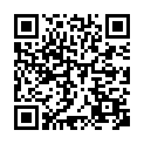

# OpenCV LiDAR C++ 시작해보기

건국대학교 일반대학원 전기기계 및 전력전자 석사과정 노태형
 

## 서론
일본에서 학부졸업 전 중고시장에서 어렵게구한 LiDAR였지만 연구실에 들어와 이리치이고 저리치이는 사이 한구석에서 썪고 있었습니다.
요번 ROS 국비교육을 통해 Robot에 대해 굉장히 관심있는 여러분들과 함꼐 다시 처음부터 시작하며 알아보고 기록하는 시간을 가지고자 합니다.

목차
- 서론
- 1. 리얼센스 개요
- 2. LiDAR를 사용하기에 앞서 환경구축해야할 것들
    - Realsense SDK를 C++로 사용하기 위해서 무엇을 준비해야하는가? 
- 3. 
## i. 리얼센스 개요
----------------------
Overview
인텔 리얼센스 SDK 2.0은 뎁스 카메라 (D400 & L500와 SR300) 크로스 플랫폼 라이브러리이다.

SDK는 깊이와 칼라 스트리밍, 내부와 외부의 교정 정보를 제공해준다.(intrinsic and extrinsic calibration information)

라이브러리는 통합적인 스트림들(pointcloud, depth and color streaming과 vise-versa)
과 스트리밍 세션의 record와 playback(코드 있음) 빌트인 서포트를 제공한다.

## ii.LiDAR를 사용하기에 앞서 환경구축해야할 것들
### - Realsense SDK를 C++로 사용하기 위해서 무엇을 준비해야하는가? 
-------------
OpenCV for C++
RealSense examples have been designed and tested with OpenCV 3.4
https://docs.opencv.org/3.4/d7/d9f/tutorial_linux_install.html

CMake
CMake란 여러 환경(window , linux 등)에 맞는 build process를 작성한 것으로, CMakeLists.txt에 기술된 내용을 바탕으로 각 확경에 맞는 Makefile을 생성해 주는 빌드 프로그램이다.

CMake를 통해 Makefile을 만들게 되면, 추가적인 파일이 추가되지 않는 한 Makefile을 수정하지 않고, 자동으로 생성해준다는 장점이 있지만, 단순히 Makefile을 생성해 주는 것이기 때문에 Make를 추가로 해야한다.

Vcpkg
Vcpkg는 Windows, Linux 및 MacOS에서 C 및 C++ 라이브러리를 관리하는 데 도움을 주는 라이브러리입니다.

## 종장

github Address:[https://github.com/Madness-Ro/project-miraisouzouten-document](https://github.com/Robotics-Ro/OpenCV-C--LiDAR)

Special Thanks 
ROS 국비교육 LiDAR 헤딩 팀

